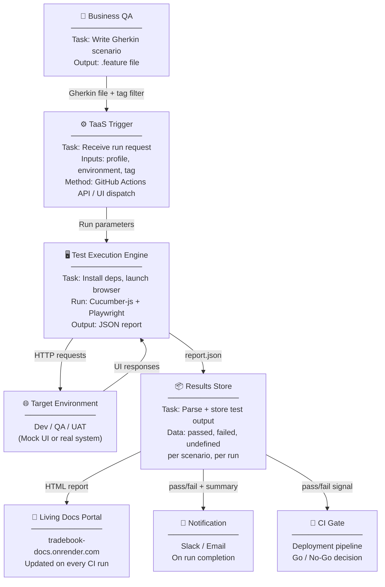

# Testing as a Service (TaaS) — Vision Document

**Project:** TradeBook QA  
**Author:** Ken Jiang  
**Date:** April 2026  
**Status:** Concept — roadmap for future evolution

---

## What Is TaaS?

Testing as a Service (TaaS) is a model where test execution, results, and quality signals are delivered as a shared, on-demand service — rather than embedded inside each individual team's codebase. Teams consume testing capability the same way they consume any other API or platform service: request it, get results, move on.

In traditional QA, every team owns, runs, and maintains their own test suite. In TaaS, a central QA platform owns the execution infrastructure. Teams define what to test (Gherkin scenarios, test contracts), and the platform handles how and when to run them.

---

## Current State of This Project

TradeBook QA already has several TaaS building blocks in place:

| Capability | Current Implementation |
|-----------|----------------------|
| Human-readable test definitions | Gherkin feature files — readable by any stakeholder |
| On-demand test execution | GitHub Actions `workflow_dispatch` — triggerable via UI or API |
| Centralised test results | Living docs at tradebook-docs.onrender.com — one URL for all stakeholders |
| Automated publishing | CI commits updated report on every run — no manual step |
| Environment portability | `.env`-driven config — point at any environment by changing one variable |
| Reusable step library | Shared step definitions — new scenarios reuse existing automation |

The project is already 60–70% of the way to a minimal TaaS offering.

---

## TaaS Vision for This Project

The goal is to evolve from a **project-scoped test suite** into a **shared testing platform** that any team in the organisation can use to validate their trading system components — without needing to build or maintain their own automation framework.



---

## Key TaaS Capabilities — Gap Analysis

| Capability | Current State | What Is Needed |
|-----------|--------------|----------------|
| **On-demand trigger** | GitHub Actions UI / manual | REST API endpoint — any system can trigger a test run via HTTP |
| **Parameterised runs** | ENV vars per run | API accepts target environment, tag filter, and browser as parameters |
| **Multi-team isolation** | Single suite, single report | Tenant-aware execution — team A's run does not affect team B's results |
| **Results API** | HTML report only | JSON results endpoint — CI pipelines can query pass/fail programmatically |
| **Notification** | None | Webhook / Slack / email on run completion |
| **Test authoring UI** | Edit `.feature` files in IDE | Web UI for Business QA to write and submit Gherkin without Git access |
| **Execution history** | Latest run only | Run history with trend view — pass rate over time |
| **SLA / priority queuing** | Not applicable | High-priority runs (smoke) jump the queue over full regression |

---

## Phase 1 — API-Triggered Execution (Near Term)

The quickest TaaS enhancement: expose the existing GitHub Actions workflow via the GitHub REST API. Any system — a deployment pipeline, a Slack bot, a release gate — can trigger a test run with a single HTTP call.

**How it works today (manual):**
```
GitHub UI → Actions → Run workflow → Select profile → Run
```

**How it would work as TaaS Phase 1:**
```bash
curl -X POST \
  -H "Authorization: Bearer $GITHUB_TOKEN" \
  -H "Accept: application/vnd.github+json" \
  https://api.github.com/repos/ken-jiang-claude/tradebook-qa/actions/workflows/cucumber-tests.yml/dispatches \
  -d '{"ref":"main","inputs":{"profile":"smoke","environment":"uat"}}'
```

Any team's deployment pipeline can call this — zero setup required on the consumer side.

---

## Phase 2 — Results as Data (Medium Term)

Convert the HTML report into a structured data API so downstream systems can consume test results programmatically:

```
GET /api/results/latest        → { passed: 56, failed: 0, undefined: 9, duration: "1m 42s" }
GET /api/results/history       → [ { date, passed, failed, runId }, ... ]
GET /api/results/{runId}       → full scenario-level detail
```

A CI pipeline can query this endpoint after a deployment to decide whether to proceed or roll back — no human needs to read the HTML report.

---

## Phase 3 — Multi-Team Platform (Long Term)

Full TaaS platform where multiple trading system teams share the execution infrastructure:

```
Team A: Order Management System  →  submits Gherkin  →  TaaS runs against OMS UAT
Team B: Settlement System        →  submits Gherkin  →  TaaS runs against Settlement UAT
Team C: RHUB Reconciliation      →  submits Gherkin  →  TaaS runs against RHUB UAT
                                          ↓
                              Central Results Dashboard
                              (all teams, all environments)
```

Each team contributes test scenarios. The platform runs them on the right environment and publishes results to a shared dashboard. No team maintains their own execution infrastructure.

---

## Role Impact — Traditional QA to TaaS

### What Changes for Business QA Analysts

| Traditional QA | TaaS |
|---|---|
| Write test cases in spreadsheets (Excel, Confluence) | Write Gherkin scenarios — same thinking, structured format |
| Execute tests manually step by step | Platform executes on demand — Business QA triggers or reads results |
| Maintain test scripts in TestRail / Zephyr / qTest | Gherkin `.feature` files in Git are the living record |
| Report pass/fail via weekly status updates | Living docs portal shows results in real time |
| Coordinate environment setup with dev teams | Platform handles it — point at Dev / QA / UAT via config |
| Regression cycles take days before each release | Smoke suite runs in minutes on every deployment |
| Bugs found late in release cycle | CI gate catches failures on every push |

### What Does NOT Change

- **Test design thinking** — identifying what to test, edge cases, boundary conditions
- **Domain knowledge** — understanding the business workflow (order lifecycle, settlement rules, etc.)
- **Acceptance criteria ownership** — defining what "pass" looks like
- **Stakeholder communication** — interpreting results, flagging risk to the right teams

### The Net Effect on the Role

```
Shrinks:   Manual execution, environment coordination, reporting overhead
Grows:     Scenario quality, coverage governance, results interpretation
New:       Gherkin writing as a core skill — structured, not freeform
```

Business QA analysts who adapt become more strategic — they own **what** gets tested, not **how** it runs. The execution layer is handled by the platform; the value of a skilled Business QA shifts to test design, domain knowledge, and quality governance.

---

## Benefits of TaaS for a Trading Organisation

| Stakeholder | Benefit |
|-------------|---------|
| **Business QA** | Write Gherkin once — platform handles execution across all environments |
| **Development teams** | Trigger tests via API from deployment pipelines — no QA team dependency |
| **QE Manager** | Single dashboard showing quality across all systems and environments |
| **Release manager** | Automated go / no-go signal based on live test results |
| **Compliance / Audit** | Immutable test evidence published on every run — always available |

---

## What Makes This Project a Good TaaS Foundation

1. **Gherkin as the contract** — scenarios are already written in a format that any team can understand and contribute to without touching code
2. **Environment-agnostic** — one `.env` change points the suite at any target environment
3. **CI already wired** — GitHub Actions runs on every push; `workflow_dispatch` adds API trigger for free
4. **Living docs portal** — a public URL for results already exists; evolving it into a results API is an incremental step
5. **Dual-mode support** — the suite runs headless or manual, making it portable across execution environments

---

## Roadmap Summary

| Phase | Capability | Effort | Value |
|-------|-----------|--------|-------|
| **Current** | Gherkin suite, CI, living docs | Done | Foundation |
| **Phase 1** | GitHub API trigger — any system can request a test run | Low | High |
| **Phase 2** | JSON results API — CI pipelines query pass/fail | Medium | High |
| **Phase 3** | Multi-team platform — shared execution, central dashboard | High | Very High |
| **Future** | Test authoring UI for Business QA — no Git required | High | Medium |
